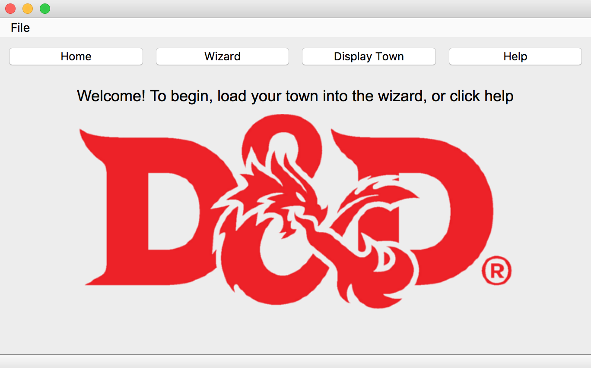
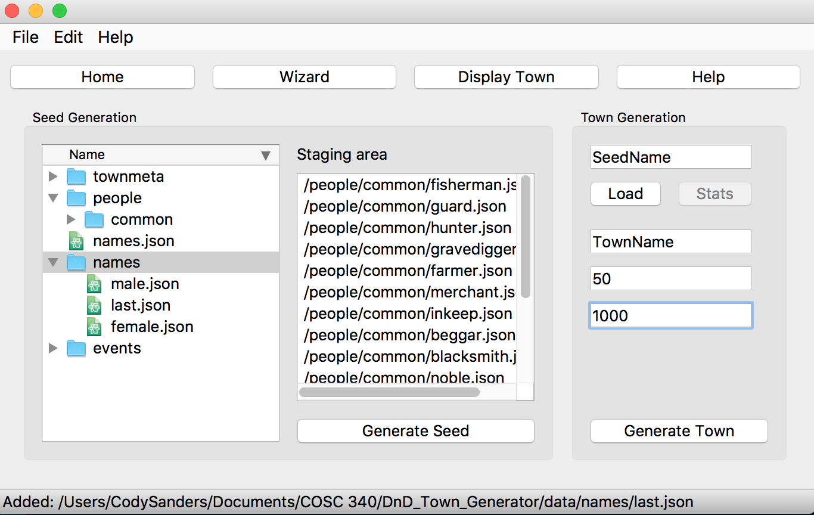
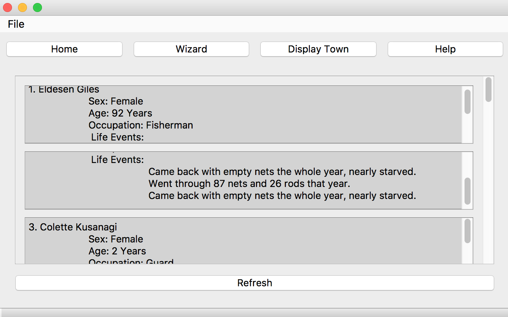

# A Dungeons and Dragons Town Generator
### By The Not Neckbeards

## Team Members:
	Dakota Sanders
	Ben Johnson
	Bert Bashford
	Matt Matto

## Introduction
One of the most popular tabletop roleplaying board games is known as Dungeons and Dragons.
For the purpose of this report, the game will be referred to as DnD.
The game revolves around player-created characters that explore a campaign created
by another player known as a Dungeon Master (DM). One of the most challenging
parts of being a dungeon master is the task of creating the campaign that the
players will play in. Part of this creation involves generating non-player-characters
(NPCs), who are characters that are not created by normal players, but are still
expected to be able to interact with player-made characters. This creates a
difficult situation for the DM, because it's hard to have backstories of every
character in a campaign.

This problem prompted us to create an application that would generate some
details about the NPCs so that the DM does not have to spend nearly as much time
creating details like names, ages, backstories, and other relevant details.
Our approach to this application is one that should allow users to upload files
that fit a certain format, so that all one has to do to add more details
is change the content of the uploaded files. This approach allowed us to
work on generating random characters while still allowing users to customize the
details available to them.

At the start of our project, we decided we wanted to set a secondary goal of map
generation. This goal would take the generated NPCs and place them on a grid
that would show the map of the town.
This goal ended up not being completed due to time restraints. To generate a
town, the level of detail required and the time needed to complete the project
was going to be much more than we could afford for the class.

Our primary goal was completed, as the project will properly generate random
characters correctly. Our secondary goal of map generation was not completed.
Our interface ended up being clean and simple to use, so overall the project
was a success.

## Customer Value
Our project has undergone some significant changes throughout the course of the
semester. The primary change has been to the user interface, as we decided to
modify the way our navigation code worked. We also significantly reduced features
of the character generation in order to increase the overall stability of our
final product.

The adoption of the new GUI took place sometime in late March. The reason for
this change was due to the developments that Ben Johnson did in his goal to
create a wizard. The wizard aspect of our app creates a seed for a town, which
contains the potential character information needed to load and generate a
town. During the course of this development, we as a team were having some
trouble keeping the already-developed toolbars accessible during changes to the
main windows. For example, navigating from the home page to the wizard page would
require significant code changes to simply display the same menu already available
on the previous page. In order to fix this problem, Ben implemented a new format
for all of the windows to follow. This format involved creating a parent view class
that would allow any child windows (i.e. the main menu, wizard, display and help screens)
to inherit the necessary menu structure and navigation screens. This solution
was significantly better suited to our needs than the work that had already been
done on the menu screen to date. As such, we decided as a group that adopting this
new format was going to save us time in the long run, and contribute to a cleaner,
easier to understand codebase as a whole.

Originally, our application sought to generate data specifically for the town
itself. This included events that were town-specific that would appear in
several of the NPCs backstories. We also wanted to have NPC to NPC interactions
available so that certain NPCs would have the unique capability to be
related to another NPCs through events or other factors. Both of these features
proved to be too ambitious due to the time needed to do important tasks like
bug-fixes. We realized around April that the code modifications needed to include
this functionality were going to be far too much to add before the end of the
semester. It turns out that adding code that will link certain NPCs together
creates a myriad of problems, primarily in that certain interactions should not
be allowed if other actions are present. As such, it would have taken far too
much time to implement, and we did not feel as though it was necessary for our
minimum viable product.

## Technology

###### Above Screenshot is the opening menu of our application.

Our minimum viable product for this semester was an app that would generate
and display the characters within the town. By the time our group presented the
project, we had completed the MVP and were ready to begin adding extra functionality.
One of the things we finished actually before the MVP was even done was the
ability to generate, save, and load seeds and towns. We also implemented functionality
to undo any additions made within the town wizard. Both of these additions
were not necessary for the minimum viable product, but we managed to create those
at the same time we implemented some of the other important features within
our app.

Our application is broken down into 4 main sections: the Main Menu, the Wizard,
the Display Page, and the Help Menu.

The Main Menu and Help menu are just display pages. The main menu displays an image
and provides navigation menus. The help menu displays an HMTL page that tells users
how to use the application.

The wizard is the most complex part of our app. It functions as follows: The user
loads in JSON files containing details on character events and character names.
From there, the user clicks "Generate seed", and is prompted for a save location
for the seed file. This seed file is automatically loaded into the town Generator
on the right side of the screen, and the user is then prompted to input a name
for the town, population, and years of history. Once "Generate Town" is clicked,
the user selects a save location for the town file. The population and years of
history designate how many characters are to be displayed, and how many events
they should have assigned to them. For each year of history, each character has
a 1 in 4 chance of being assigned an event.

###### Above Screenshot is the wizard screen

Finally, the display screen can be loaded in once a town file is generated.
There is a "Refresh" button at the bottom in case something goes wrong.
This menu will show each NPC, including all relevant generated details regarding
that NPC. This window is scrollable, and includes sub-scrollable text boxes for
each NPC.

###### Above Screenshot is the display screen

We've done quite a bit of testing on our product, and during the course of that
time we've discovered several small bugs that need to be fixed. Of these,
the main concerns we've found include clearing the display menu after loading
a new town, no delete button in the wizard, and a strange assortment of GUI issues
only present on MacOS.

## Team
At the beginning, our team self-separated into two teams: the backend team and the
GUI team. The backend team consisted of Bert Bashford and Ben Johnson. The GUI team
consisted of Dakota Sanders and Matt Matto. These teams persisted until the middle
of March, when we decided to ditch the current GUI design.

From then on, we all had an equal part in the generation and display of the content.
Each team members' contributions are as follows:

    Dakota Sanders: Responsible for the help menu and the display menu.
    Matt Matto: Responsible for the icon, display menu, and bugfixes.
    Bert Bashford: Responsible for most of the randomization and test files.
    Ben Johnson: Responsible for application architecture and wizard development.

## Project Management
We managed to create a functioning generator that could deliver useful information
to a dungeon master in a visually pleasing format.
Time constraints forced us to abandon the goals of town-wide events and interaction
between characters (i.e. marriage). The idea of map generation was also abandoned
much earlier. Time was the main constraint on these goals, but they were secondary
goals, so that is alright.

## Reflection
Some of the things that went very well were our selection of PyQt5 as our framework.
This ended up being a very useful and fun framework to code in, and the final product
looks nice and functions well. Our interactions as a team also went very well.
Our communication was open and we split up the work more or less evenly among
members. Our code had good synergy, and we had very few merge conflicts or
troubles getting everyone to understand their part or what other members' code did.

Some things that did not go well were the initial development of our GUI, primarily
due to poor planning. We should have planned out what our application would look
like visually before we tried to create a GUI at all. This would have saved us a
tremendous amount of time, and allowed us to pursue more of our secondary goals.
There are also still a number of bugs that did not reveal themselves until the very
end of the project, so there were issues in our final demonstration that will
need to be ironed out if the code is to continue.
One of the issues we encountered was a difference in Python versions. Some of us
were running Python 3.6.5, while some of us were still running older versions.
This created issues with some of the code we had written, so we had to update the
Python versions across our team, which ended up being harder than we first imagined.

Overall the final project was a success. It does what it is supposed to do, and it
does it in a fast, clean, and easy to understand way. We are not that far From
achieving our secondary goals, so this project could easily be continued if we
desire.
